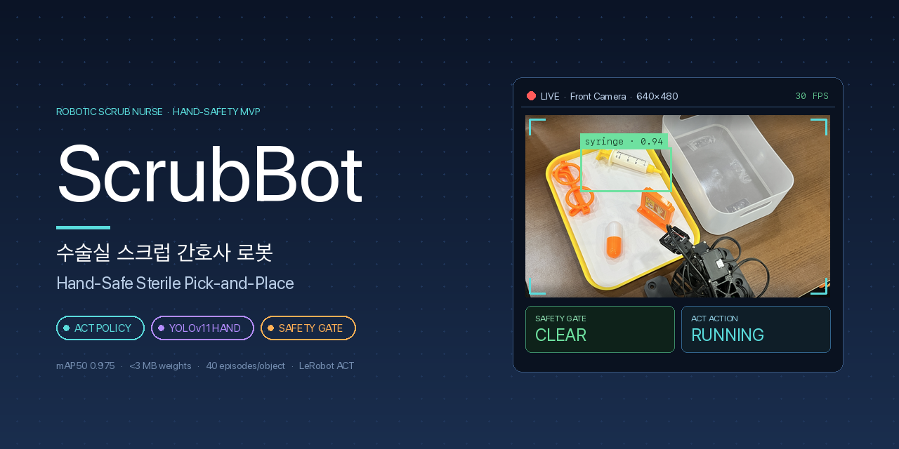

# ScrubBot



수술실에서 집도의에게 도구를 건네주는 **스크럽 간호사(scrub nurse)의 도구 전달 역할**을 대신하는 로봇 매니퓰레이터 시스템. 멸균 필드(sterile field) 오염을 방지하기 위해 카메라로 사람 손을 감시하다가 손이 감지되면 로봇 작업을 즉시 중단한다.

---

## 문제 배경

수술실의 스크럽 간호사는 집도의 옆에서 트레이의 수술 도구를 정확히 집어 손에 건네주는 역할을 한다. 이 과정에서 도구는 반드시 멸균 상태를 유지해야 하며, 비멸균 손이 트레이에 닿으면 그 도구는 폐기 또는 재멸균 대상이 된다.

ScrubBot은 이 반복적인 pick-and-place 작업을 로봇 + 모방학습으로 재현하고, 멸균 필드에 사람 손이 진입할 경우 자동으로 정지하는 안전 계층을 함께 구현한다.

---

## 시스템 구성

세 개의 계층이 실시간으로 협력한다.

1. **ACT 정책 (물체별)** — Action Chunking Transformer 기반 모방학습 정책. Leader 로봇의 교시 데이터로 학습된 후, Follower 로봇에서 자동 실행.
2. **YOLOv11 손 감지** — Front 카메라 프레임에서 사람 손을 실시간 검출.
3. **Safety Gate** — YOLO 판정 결과에 따라 ACT의 관절 액션을 통과시킬지 차단할지 결정. **손 감지 → 로봇 정지 · 10초 clear → 재개**.

파이프라인 다이어그램: [`docs/diagrams/pipeline_diagram.excalidraw`](docs/diagrams/pipeline_diagram.excalidraw)
사용자 시나리오: [`docs/diagrams/user_scenario.excalidraw`](docs/diagrams/user_scenario.excalidraw)

### 하드웨어

- **로봇**: OMX-Leader (교시용) + OMX-Follower (자동 실행용) 듀얼 OpenManipulator X, 각 6관절
- **카메라**: front + wrist 시점 (각 640×480)

### 대상 물체

실제 수술 도구 확보가 어려워 접근 가능한 대체물로 파이프라인 유효성을 검증했다. 크기·형태·grasp 난이도를 다양화해서 정책 일반화 여부를 확인한다.

| 물체          | 성격                 |
| ------------- | -------------------- |
| 장난감 주사기 | 얇고 긴 형태         |
| 알약          | 작고 미끄러움        |
| 안경          | 비대칭 · 얇은 프레임 |
| 엑스레이 필름 | 얇고 넓은 평면       |

---

## 결과 요약

**손 감지 (YOLOv11n)**

| 지표           | 값                                           |
| -------------- | -------------------------------------------- |
| mAP50          | 0.975                                        |
| Precision      | 0.900                                        |
| Recall         | 0.995                                        |
| 학습 epoch     | 86 (patience 20, 조기 종료)                  |
| 배포 모델 크기 | <3 MB                                        |
| 배포 파일      | `outputs/train/hand_yolo_v1/weights/best.pt` |

**ACT 정책 (물체별)**

- 물체당 40 에피소드 수집 → train/valid/test = 28/6/6 분할
- Action chunk 20 step (~0.67초마다 카메라 재관측)
- 학습: batch 8, 20K step, LeRobot 프레임워크

**통합**

- 실시간 파이프라인에서 손 감지 시 로봇 정지 · 10초 클리어 후 재개 로직 동작 확인
- 시연 영상은 발표 자료에 포함

---

## 저장소 구조

```
ExpertSurgicalMentor/
├── config/
│   └── omx_start_pose.json            # OMX-Follower 초기 자세 (관절값 중앙값)
├── datasets/
│   └── hand/
│       ├── raw/                        # 원본 캡처 (git ignored, 재생성 가능)
│       └── yolo_v1/hospital.yolov11/   # Roboflow 라벨링 export (train/valid)
├── docs/
│   ├── command.md                      # 데이터 수집·학습·평가 전체 워크플로 런북
│   ├── hand_safety_dataset.md          # 손 감지 데이터셋 문서
│   ├── hand_yolo_training.md           # YOLO 학습 결과 보고서
│   ├── ExpertSurgicalMentor_plan.md    # 초기 아키텍처 · 절차 기획안
│   └── diagrams/                       # Excalidraw 파이프라인 · 시나리오 다이어그램
├── outputs/
│   └── train/hand_yolo_v1/             # 배포용 YOLO 학습 결과 (weights/best.pt 등)
├── scripts/
│   ├── collect_hand_images.py          # 손 감지용 이미지 대화형 수집 도구
│   ├── train_hand_yolo.sh              # YOLOv11 손 감지 학습
│   ├── train_hand_yolo_sweep.sh        # n/s/m 크기 비교 스윕 + 요약표 자동 생성
│   ├── record_object_dataset.sh        # OMX-Leader 교시 데이터 수집 (LeRobot)
│   ├── split_lerobot_40.sh             # 40 에피소드 train/valid/test 분할
│   ├── train_act_objects.sh            # 물체별 ACT 정책 학습
│   ├── split_train_syringe_100k.sh     # syringe 분할 + 100K step 학습 자동화
│   ├── split_train_act_objects_100k.sh # 다중 물체 순차 학습 큐
│   ├── upload_lerobot_dataset.sh       # HuggingFace Hub 업로드
│   └── run_act_object.sh               # 실시간 ACT 추론 + 손 감지 안전 정지
├── src/
│   ├── omx_f_keyboard_teleop.py        # OMX-Follower 키보드 원격 제어
│   └── lerobot/                        # LeRobot 프레임워크 (submodule)
└── README.md
```

---

## 요구 사항

- Python 3.8+
- PyTorch 2.10+ (CUDA 12.8 권장), Mac은 MPS 사용 가능
- `ultralytics` — YOLOv11 학습·추론
- `lerobot` — Hugging Face LeRobot 프레임워크 (모방학습 정책)
- `opencv-python` — 카메라 캡처
- HuggingFace 계정 (데이터셋 업로드 시)

Submodule 초기화 (LeRobot):

```bash
git submodule update --init --recursive
```

---

## 데이터셋

### 손 감지 (150장, 커밋됨)

- `datasets/hand/yolo_v1/hospital.yolov11/` — Roboflow 라벨링 export
- 클래스: `hand` (단일)
- 그리퍼 오탐 방지를 위해 데이터 수집 시 세 카테고리로 균형 구성
  - **A** 손 단독
  - **B** 손과 도구 근접
  - **N** 배경 + 로봇 그리퍼만 (부정 샘플)
- 세부 문서: [`docs/hand_safety_dataset.md`](docs/hand_safety_dataset.md)

### ACT (HuggingFace Hub)

- 저장소: `1unasy/pick_and_place_v2*` (물체별 branch)
- 포맷: LeRobot (Parquet + MP4/WebP)
- 물체당 40 에피소드

---

## 학습 및 실행

전체 명령어와 튜닝 가이드는 [`docs/command.md`](docs/command.md)에 정리되어 있다.

### 손 감지 학습

**단일 모델 학습** (기본값 YOLOv11n):

```bash
scripts/train_hand_yolo.sh
```

환경변수로 파라미터 조정 가능:

```bash
MODEL=yolo11s.pt EPOCHS=100 BATCH=16 DEVICE=0 \
  scripts/train_hand_yolo.sh
```

**n/s/m 크기 비교 스윕**:

```bash
VARIANTS="n s m" EPOCHS=100 BATCH=16 DEVICE=0 \
  scripts/train_hand_yolo_sweep.sh
```

→ `outputs/train/sweep_v1_summary.csv`에 각 크기의 mAP50, mAP50-95, 학습 시간, 모델 크기가 표로 저장된다.

### ACT 정책 학습

**1. Leader 교시로 데이터 수집** (물체당 40 에피소드 목표):

```bash
scripts/record_object_dataset.sh <object_name>
```

**2. train/valid/test 분할** (28/6/6):

```bash
scripts/split_lerobot_40.sh <object_name>
```

**3. ACT 정책 학습**:

```bash
scripts/train_act_objects.sh <object_name>
```

**4. HuggingFace Hub 업로드** (선택):

```bash
scripts/upload_lerobot_dataset.sh <object_name>
```

### 통합 실행 (Safety-Gated Pick-and-Place)

```bash
scripts/run_act_object.sh <object_name>
```

기본으로 YOLO 손 감지 모델이 함께 실행된다. 감지 conf threshold는 `--safety-conf` 옵션으로 조정 (기본 0.15).

---

## 한계 및 향후 과제

- **VLM 라우터 미구현** — 현재는 사용자가 물체명을 직접 지정. 자연어 명령 "○○ 도구 줘" → 정책 자동 선택은 다음 단계.
- **실제 수술 도구 미사용** — 접근 가능한 대체물로 검증. 실제 겸자·니들 홀더 등 도구로의 확장은 추가 데이터 수집 필요.
- **대규모 반복 검증 없음** — 물체당 10회 이상의 성공률 통계 필요.
- **실환자·임상 검증은 범위 밖** — 본 프로젝트는 학생 MVP 단계.

---

## 참고 문서

| 문서                                                                                     | 내용                                                       |
| ---------------------------------------------------------------------------------------- | ---------------------------------------------------------- |
| [`docs/command.md`](docs/command.md)                                                     | 데이터 수집 → 분할 → 학습 → 평가 전체 워크플로 (한글 런북) |
| [`docs/hand_safety_dataset.md`](docs/hand_safety_dataset.md)                             | 손 감지 데이터셋 구성과 라벨링                             |
| [`docs/hand_yolo_training.md`](docs/hand_yolo_training.md)                               | YOLO 학습 결과 보고서 (86 epoch, mAP50 0.975)              |
| [`docs/ExpertSurgicalMentor_plan.md`](docs/ExpertSurgicalMentor_plan.md)                 | 초기 아키텍처와 절차 기획안                                |
| [`docs/diagrams/pipeline_diagram.excalidraw`](docs/diagrams/pipeline_diagram.excalidraw) | 학습 + 실시간 추론 전체 파이프라인                         |
| [`docs/diagrams/user_scenario.excalidraw`](docs/diagrams/user_scenario.excalidraw)       | 사용자 시나리오 (도구 전달 흐름)                           |
