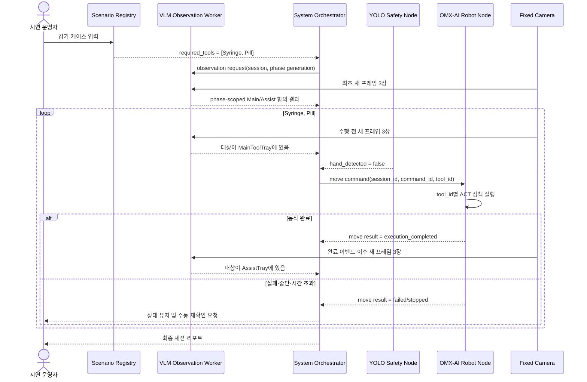

# Syringe and Pill Demo System - Plan

## Goal Capsule

감기 가상 케이스를 입력하면 등록된 순서 `Syringe -> Pill`을 조회하고, 양자화 VLM이 두 물품의 MainToolTray/AssistTray 위치를 연속 3프레임으로 확인한 뒤, OMX-AI 로봇팔의 물체별 ACT 정책이 두 물품을 하나씩 AssistTray로 옮기는 시연 시스템을 완성한다. VLM은 물품 존재·트레이 위치·이동 결과만 판단하고, 로봇 제어와 손 안전정지는 각각 ACT 실행기와 YOLO 안전 계층이 담당한다.

시연 성공 기준은 입력부터 최종 리포트까지 수동 상태 조작 없이 이어지는 것이다. 각 물품은 수행 전 MainToolTray에서 3회 연속 확인되어야 하고, OMX-AI 완료 이벤트 이후 촬영한 새 3프레임에서 AssistTray 도착이 확인되어야만 `moved_tools`에 추가된다.

## Product Contract

### Summary

현재 실제로 사용할 수 있는 물품은 장난감 주사기와 알약 모형뿐이므로 시연 범위를 감기 한 종류로 좁힌다. `case_id`, `patient_id`, `disease_name`만 입력 데이터이며, 질환과 필요 물품의 연결은 Scenario Registry가 결정한다. VLM에는 해당 필요 물품 목록과 현재 카메라 프레임을 전달하되, VLM이 질환을 해석하거나 이동 좌표를 생성하게 하지 않는다.

VLM은 먼저 추가 학습 없이 세 양자화 후보를 실카메라 평가셋으로 비교한다. 정확성 기준을 만족하는 가장 작은 모델을 선택하며, 파인튜닝은 모든 후보가 반복적으로 같은 시각 오류를 보이고 카메라·프롬프트 수정으로 해결되지 않을 때만 후속 작업으로 검토한다.

### Problem Frame

현재 저장소에는 케이스 검증, 질환별 필요 물품 조회, Qwen VLM 로더, 3프레임 합의 상태 머신과 ROS 2 입출력 골격이 있다. 반면 실제 카메라 장면을 반영한 Syringe/Pill 전용 평가셋, VLM 평가 합격 기준, `tool_id`에 따라 ACT 체크포인트를 선택하는 OMX-AI 실행기, 이동 실패·안전정지 계약, 전체 노드를 함께 실행하는 통합 계층은 없다.

VLM과 ACT를 직접 연결하면 인식 결과와 로봇 실행 책임이 섞인다. 이 계획은 ROS 2 이벤트를 경계로 두어 VLM이 물품 이동을 요청하고, OMX-AI 어댑터가 ACT 정책 실행 결과를 돌려주며, VLM이 실제 장면에서 결과를 다시 검증하도록 한다.

### Requirements

- **R1.** 시연 입력은 영문·숫자 조합의 `patient_id`, 고유한 `case_id`, `감기`인 `disease_name`만 포함한다.
- **R2.** Scenario Registry는 감기 입력을 `Syringe -> Pill` 순서로 결정하며, 이 순서는 VLM 출력이 아니라 코드 설정에서 가져온다.
- **R3.** VLM은 `required_tools` 중 실제로 보이는 물품과 각 물품이 MainToolTray 또는 AssistTray 중 어디에 있는지만 판정한다.
- **R4.** 최초 확인, 수행 전 확인, 수행 후 확인은 각기 새로 촬영한 연속 3프레임의 VLM 결과가 모두 일치해야 통과한다.
- **R5.** 수행 전 대상 물품이 MainToolTray에 확인되지 않거나 판단이 불일치하면 로봇 명령을 발행하지 않고 같은 상태에서 재확인한다.
- **R6.** OMX-AI가 동작 완료를 보고한 뒤에도 대상 물품이 AssistTray에서 3프레임 연속 확인되지 않으면 성공 처리하지 않는다.
- **R7.** OMX-AI 실행 계층은 `Syringe`와 `Pill`을 각 ACT 체크포인트에 결정적으로 매핑하고, 한 번에 하나의 정책만 실행한다.
- **R8.** YOLO는 손 유무만 감지한다. 손이 감지되면 새 이동을 막고 실행 중인 OMX-AI 동작을 직접 중단시키며, VLM은 안전정지 해제 권한을 갖지 않는다.
- **R9.** 시스템은 최종적으로 필요한 물품, 확인된 물품, 누락된 물품, 옮긴 물품과 세션 성공 여부를 구조화된 리포트로 출력한다.
- **R10.** VLM 모델은 모두 NF4 4-bit로 비교하고, 추가 학습 없이 정확성·3프레임 안정성·지연 시간·GPU 메모리를 측정해 선택한다.
- **R11.** VLM과 ACT가 같은 GPU를 사용할 경우 단계별 추론을 직렬화하고, 통합 실행 전에 동시 상주 VRAM과 장시간 실행 안정성을 검증한다.
- **R12.** 이 시스템은 장난감 물품을 사용하는 교육용 시연이며 실제 진단, 처방, 투약 또는 사람 손으로의 직접 전달을 수행하지 않는다.
- **R13.** 세션·단계·명령 상태는 Orchestrator 하나만 변경하며, VLM과 OMX-AI 노드는 관측 또는 실행 결과만 반환한다.
- **R14.** 안전 상태는 `UNKNOWN`, `SAFE`, `STOP_LATCHED`, `SAFETY_FAULT`로 구분하고, 최신 `SAFE`가 확인되지 않거나 안전 신호가 오래되면 로봇 명령을 금지한다.

### Actors and Responsibilities

- **시연 운영자:** 비식별 가상 케이스를 입력하고 MainToolTray를 초기 배치하며 안전정지 후 재개 여부를 결정한다.
- **Scenario Registry:** 질환을 고정된 필요 물품 순서로 변환한다.
- **VLM Inventory Node:** 카메라 이미지에서 필요 물품의 존재와 트레이 위치를 판정한다.
- **System Orchestrator:** 세 단계의 3프레임 검사, 이동 명령, 완료·실패 이벤트와 재시도 상태를 조정한다.
- **OMX-AI Robot Node:** 물품별 ACT 체크포인트를 선택해 MainToolTray에서 AssistTray로 한 번 이동한다.
- **YOLO Safety Node:** 손 감지를 래치하고 로봇 실행 허용·중단 상태를 제공한다.

### Key Flows

- **F1. 정상 시연:** 감기 케이스 입력 -> 두 물품 초기 확인 -> Syringe 수행 전 확인 및 이동 -> Syringe 도착 확인 -> Pill 수행 전 확인 및 이동 -> Pill 도착 확인 -> 완료 리포트.
- **F2. 초기 누락:** 최초 3프레임에서 한 물품이 보이지 않으면 해당 물품을 `missing_tools`에 기록하고 실제로 확인된 물품만 대기열에 둔다.
- **F3. 수행 전 상태 변화:** 대기열 대상이 MainToolTray에서 사라졌거나 트레이 위치 판정이 불안정하면 명령 없이 해당 물품의 수행 전 확인을 반복한다.
- **F4. 이동 실패:** OMX-AI가 실패·중단·시간 초과를 반환하거나, 완료 후 AssistTray 확인에 실패하면 `moved_tools`를 유지하고 운영자 재확인 전 자동 재실행하지 않는다.
- **F5. 손 진입:** 어느 단계에서든 손을 감지하면 프레임 합의를 폐기하고 새 명령을 차단한다. 이동 중이면 안전 계층이 OMX-AI 실행을 중단하고 실패 결과를 남긴다.
- **F6. 복구 또는 종료:** 로봇 실패·중단·사후 확인 실패는 자동 재실행하지 않는다. 운영자는 장면 재확인, 물품을 MainToolTray로 복구한 뒤 새 이동 재시도, 또는 세션 중단 중 하나를 명시적으로 선택한다.

### Acceptance Examples

- **AE1. 정상 완료:** `{"patient_id":"DEMO01A","case_id":"DEMO_COLD_001","disease_name":"감기"}`를 입력하고 두 물품이 MainToolTray에 있으면 최종 `moved_tools`가 `["Syringe","Pill"]`이고 상태가 `completed`이다.
- **AE2. 순서 보장:** Pill이 더 가까이 있어도 첫 `/robot/move_command`의 대상은 `Syringe`이며, Syringe 검증 전에는 Pill 명령을 발행하지 않는다.
- **AE3. 사전 확인 실패:** Pill 차례에 Pill이 MainToolTray에서 제거되면 Pill ACT 정책은 시작되지 않고 대기열은 유지된다.
- **AE4. 사후 확인 실패:** OMX-AI가 Syringe 완료를 보고했지만 Syringe가 AssistTray에 보이지 않으면 `moved_tools`는 비어 있고 Pill로 진행하지 않는다.
- **AE5. 손 안전정지:** ACT 실행 중 손이 감지되면 로봇 실행은 중단되고 성공 완료 이벤트가 발행되지 않는다.
- **AE6. 미등록 질환:** 다른 질환 입력은 `등록되지 않은 질환입니다.`를 반환하고 카메라 확인과 로봇 실행을 시작하지 않는다.
- **AE7. 부분 완료:** 최초부터 한 물품이 누락되면 확인된 물품만 옮길 수 있지만 최종 상태는 `partial_completed`, `success=false`이며 정상 시연 완료로 표시하지 않는다.
- **AE8. 이전 물품 유지:** Pill 이동 후 최종 확인에서 Syringe가 AssistTray에 없으면 Pill만 보이더라도 `completed`가 되지 않는다.

### Scope Boundaries

#### In Scope

- Syringe와 Pill만 사용하는 감기 시나리오
- 세 양자화 VLM의 실카메라 추론 비교
- 연속 3프레임 인벤토리·사전·사후 검증
- Syringe/Pill 물체별 ACT 체크포인트 실행
- OMX-AI와 VLM 사이의 ROS 2 명령·결과 교환
- YOLO 손 감지에 의한 명령 차단과 실행 중단
- 정상 시연 및 짧은 안전 실패 시연을 위한 런북

#### Out of Scope

- 폐렴·골절과 XRay·Glasses를 포함한 실제 시연
- 실제 의료 판단, 약물 추천, 용량 또는 처방 생성
- VLM의 로봇 좌표·파지점 생성
- VLM 파인튜닝과 ACT 시연 데이터의 추가 자동 수집
- 사람이 들고 있는 물품 추적 또는 사람 손으로 직접 전달

#### Deferred to Follow-Up Work

- 물체별 30개 ACT 학습 후에도 파지가 불안정한 경우의 물품 검출 YOLO+ACT 위치 보정
- 세 VLM 모두 평가 기준을 충족하지 못하고 오류가 체계적으로 반복될 때의 VLM LoRA 파인튜닝
- 이동 피드백·취소·진행률이 더 복잡해질 때 JSON 토픽을 ROS 2 Action 인터페이스로 승격

## Planning Contract

### Key Technical Decisions

- **KTD1. Registry가 질환과 필요 물품을 매칭한다.** `(session-settled: user-directed — chosen over VLM disease-to-tool generation: 고정된 교육용 시나리오에서 순서의 결정성과 검증 가능성을 유지하기 위함)`
- **KTD2. VLM은 학습 없이 양자화 추론 비교부터 시작한다.** `(session-settled: user-approved — chosen over immediate VLM fine-tuning: 두 물품과 두 트레이로 제한된 분류 문제는 프롬프트와 실환경 평가로 먼저 검증할 수 있기 때문)`
- **KTD3. 모든 시각 판정은 연속 3프레임 만장일치로 통과한다.** `(session-settled: user-directed — chosen over single-frame decisions: 순간 가림과 프레임별 흔들림으로 인한 오작동을 줄이기 위함)`
- **KTD4. YOLO는 손 감지만 담당한다.** `(session-settled: user-directed — chosen over using YOLO for tool detection in the MVP: 현재 안전 감지 범위를 분명히 하고 기존 ACT 방식의 성능을 먼저 평가하기 위함)`
- **KTD5. 로봇 이동은 MainToolTray에서 AssistTray까지만 수행한다.** `(session-settled: user-directed — chosen over direct handover to a person: 사람이 물품을 가져가는 구조가 더 단순하고 안전하기 때문)`
- **KTD6. VLM과 OMX-AI는 ROS 2 이벤트로 결합한다.** VLM이 ACT 모델을 직접 호출하지 않고 Orchestrator가 명령을 전달한다. 기존 토픽 골격을 확장해 구현 비용을 낮추되 명령별 고유 ID와 명시적 실패 상태를 추가한다.
- **KTD7. 성공 판단은 로봇의 자체 완료와 VLM의 시각 확인을 분리한다.** OMX-AI의 완료는 동작 코드가 끝났다는 뜻이고, 실제 AssistTray 도착은 이후 새 프레임의 VLM 결과가 증명한다.
- **KTD8. GPU 작업은 상태 단계별로 직렬화한다.** VLM 확인 중에는 ACT를 실행하지 않고 ACT 실행 중에는 VLM 추론을 시작하지 않는다. 모델 동시 상주가 불가능한 장비에서는 프로세스 수명주기 기반 unload/reload를 사용한다.
- **KTD9. Orchestrator가 유일한 세션 상태 소유자다.** 기존 VLM Controller의 합의·검증 도메인 로직은 재사용하되, 이동 명령·대기열·재시도·최종 리포트 변경 권한은 Orchestrator로 옮긴다. VLM Node는 `session_id`와 `observation_id`로 범위가 지정된 3프레임 관측 결과만 반환한다.
- **KTD10. 안전 이벤트는 추론·정책 실행보다 우선한다.** Safety Node와 하드웨어 stop 경로는 VLM/ACT 콜백 및 GPU 작업과 독립적으로 동작한다. VLM 추론이 끝난 뒤에도 명령 발행 직전 최신 `safety_epoch`를 다시 검사하고, epoch가 바뀌었으면 추론 결과를 폐기한다.
- **KTD11. 이동 실행 완료와 시각적 이동 성공의 이름을 분리한다.** Robot Node의 정상 terminal은 `execution_completed`로 표현하고, `move_verified`와 `moved_tools`는 사후 VLM 합의를 통과한 뒤에만 Orchestrator가 만든다.

### High-Level Technical Design



OMX-AI와 VLM 사이에는 이미지나 관절값을 직접 주고받지 않는다. VLM 측은 의미 수준의 물품·트레이 관측만 반환하고, OMX-AI 측은 카메라 관측·관절 상태를 ACT 정책 입력으로 사용해 실제 제어 명령을 생성한다. Orchestrator가 두 결과를 `session_id`, 단계 세대, 명령 ID로 연결한다. VLM Node는 이동 명령이나 세션 리포트를 발행하지 않으며, OMX-AI Robot Node도 `moved_tools`를 변경하지 않는다.

### ROS 2 Information Contract

| 방향 | 채널 | 발행 주체 | 핵심 필드 | 의미 |
|---|---|---|---|---|
| 입력 | `/case/input` | 운영 UI/CLI | `patient_id`, `case_id`, `disease_name` | 새 시연 시작 |
| 입력 | `/camera/keyframe` | 카메라 노드 | 이미지, 촬영 시각 | VLM용 정지 장면 |
| 안전 | `/safety/hand_state` | YOLO Safety Node | `session_id`, `safety_epoch`, `state`, `observed_at` | `UNKNOWN`, `SAFE`, `STOP_LATCHED`, `SAFETY_FAULT` |
| 관측 요청 | `/inventory/observation_request` | Orchestrator | `session_id`, `observation_id`, `phase_generation`, `min_frame_seq` | VLM 3프레임 검사 시작 |
| 관측 결과 | `/inventory/observation_result` | VLM Node | 요청 식별자, frame sequence 3개, 물품·트레이 결과 | 상태를 바꾸지 않는 시각 관측 |
| 명령 | `/robot/move_command` | Orchestrator | `session_id`, `command_id`, `attempt_no`, `tool_id`, `source`, `target`, `safety_epoch` | 물체별 ACT 한 번 실행 |
| 상태 | `/robot/move_status` | OMX-AI Robot Node | 세션·명령 식별자, `status_seq`, `status`, `reason` | `accepted`, `running`, `execution_completed`, `failed`, `stopping`, `stopped_safe`, `timeout` |
| 안전 | `/robot/stop` | Safety Controller | `stop_id`, `session_id`, `command_id`, `safety_epoch`, `reason` | 활성 정책과 하드웨어 정지 요청 |
| 제어 | `/session/control` | 운영 UI/CLI | `session_id`, `action`, `reason` | `reverify_scene`, `retry_motion`, `abort_session`, `reset_safety` |
| 결과 | `/inventory/state` | Orchestrator | `required`, `present`, `missing`, `move_queue`, `moved` | 현재 시연 상태 |
| 결과 | `/session/report` | Orchestrator | 최종 상태와 물품 목록 | 영상·운영자 표시용 결과 |

`/case/input`을 제외한 모든 JSON 이벤트는 `schema_version`, `session_id`, 고유 event ID와 발행 시각을 공통 envelope로 갖는다. `/case/input`은 R1의 세 필드만 받고 Orchestrator가 입력을 수락한 뒤 `session_id`를 새로 발급한다. 같은 `case_id`를 다시 실행해도 새 session ID를 사용하며, `phase_generation`은 단계 변경 때마다 증가한다. 이미지 freshness는 서로 다른 clock의 절대시각을 직접 비교하지 않고 카메라의 단조 증가 `frame_seq`를 기준으로 한다. 3프레임은 같은 session/observation에 속하고 sequence가 고유·증가하며 최소 간격과 최대 묶음 시간을 만족해야 한다.

`command_id`는 중복 ROS 메시지로 같은 ACT 정책이 두 번 실행되는 것을 막는다. OMX-AI Robot Node는 같은 ID를 다시 받으면 새 동작을 시작하지 않고 기존 상태를 재발행한다. 명령 상태는 `issued -> accepted -> running -> exactly one terminal` 순서이며 첫 terminal은 불변이다. timeout·stop 뒤 늦게 도착한 `execution_completed`는 protocol violation으로 기록하되 상태를 되돌리지 않는다. `execution_completed` 이후 로봇 정지 확인과 장면 안정화 구간이 지난 다음에만 새 post-move observation을 시작한다.

Safety Node가 아직 시작되지 않았거나 마지막 안전 관측이 TTL을 넘기면 `UNKNOWN`으로 간주해 명령을 막는다. Robot Node도 명령을 accept하기 직전에 같은 최신 SAFE epoch를 독립적으로 확인한다. stop 요청 자체는 정지 증거가 아니며, driver/hardware가 stationary 상태를 확인한 `stopped_safe`가 있어야 운영자 접근과 reset을 허용한다.

### VLM Experiment Protocol

#### 1. 평가 데이터 수집

`virtual_cases_15.json`은 질환 입력과 기대 계획을 확인하는 케이스 데이터이며 이미지 학습 데이터가 아니다. Syringe/Pill 전용 VLM 평가 데이터는 고정 카메라의 실제 작업 공간에서 별도로 만든다.

다음 6개 장면 상태를 사용한다.

| 상태 | MainToolTray | AssistTray | 검증 목적 |
|---|---|---|---|
| S0 | Syringe, Pill | 비어 있음 | 최초 확인과 첫 이동 준비 |
| S1 | Pill | Syringe | Syringe 이동 후와 Pill 이동 전 |
| S2 | 비어 있음 | Syringe, Pill | 최종 완료 |
| S3 | Pill | 비어 있음 | Syringe 누락 오검출 방지 |
| S4 | Syringe | 비어 있음 | Pill 누락 오검출 방지 |
| S5 | 비어 있음 | 비어 있음 | 빈 트레이 환각 방지 |

각 상태는 위치·회전·조명 조건을 바꾼 5개 시행으로 촬영하고, 시행마다 시간 간격이 있는 연속 3프레임을 저장한다. 최소 평가량은 `6 states x 5 trials x 3 frames = 90 frames`이다. 세 프레임은 같은 영상을 단순 복제하지 않고 로봇과 트레이가 정지한 상태에서 각각 새 타임스탬프로 촬영한다.

#### 2. 추론 비교

모델은 `Qwen3-VL 2B -> Qwen2.5-VL 3B -> Qwen3-VL 4B` 순서로 NF4 4-bit 추론한다. 각 모델에서 다음을 기록한다.

- JSON Schema 유효 출력 비율
- 단일 프레임의 물품 존재·트레이 위치 exact match
- 3프레임 묶음의 만장일치 성공·재확인 비율
- 누락 물품을 있다고 판단한 false-ready 횟수
- 프레임당 P50/P95 지연 시간
- 모델 로드 후 VRAM과 ACT 모델 동시 상주 시 최대 VRAM

선택 게이트는 Schema 유효율 100%, 전체 단일 프레임 exact match 95% 이상, S0/S1/S2의 정상 시연 묶음 통과율 100%, S3/S4/S5의 false-ready 0건이다. 정확성 게이트를 만족한 후보 중 P95 지연 시간이 가장 짧고 통합 VRAM 검사를 통과한 가장 작은 모델을 선택한다. 지연 시간 목표는 프레임당 P95 3초 이하로 두되, 장비에서 달성하지 못하면 합의 프레임 수를 줄이지 않고 입력 해상도와 키프레임 발행 간격을 조정한다.

평가용 S1/S2는 VLM의 트레이 판별 능력을 검증하지만 정상 시연의 허용 초기 상태는 S0로 고정한다. S3/S4에서는 보이는 물품만 옮길 수 있으나 세션 결과는 `partial_completed`, `success=false`로 분리한다. 모든 사후 검사에서는 이번 대상뿐 아니라 이전 `moved_tools` 전체가 현재 AssistTray에 계속 보이는지도 확인한다. 최종 `completed`는 두 required tools가 마지막 새 3프레임 모두에서 AssistTray에 있을 때만 허용한다.

#### 3. 파인튜닝 판단

초기 구현에서는 VLM 가중치를 학습하지 않는다. 모든 후보가 게이트를 실패하면 먼저 카메라 고정, 트레이 경계 표시, 조명, 물품 간 간격, 프롬프트와 이미지 크기를 점검한다. 이러한 수정 후에도 같은 물품·트레이 혼동이 반복되고 더 다양한 학습용 장면을 별도로 확보했을 때만 LoRA 파인튜닝 계획을 새로 작성한다. 평가용 90프레임은 파인튜닝 데이터로 재사용하지 않는다.

### ACT Experiment Protocol

Syringe와 Pill은 각각 30개 모방 시연으로 별도 ACT 정책을 학습한다. 각 정책은 학습에 사용하지 않은 시작 위치·회전 조건에서 최소 10회 평가하고 목표 선택, 파지, 이동 중 유지, AssistTray 배치, 홈 복귀를 따로 기록한다. 전체 성공률뿐 아니라 파지 실패 위치를 남겨 VLM 실패와 로봇 제어 실패를 구분한다.

ACT 정책이 30개 학습 후에도 목표 근처까지만 가고 정확히 집지 못하면 VLM을 좌표 생성기로 확장하지 않는다. 후속 단계에서 물품 검출 YOLO가 대상 중심 또는 bounding box를 제공하고, 이를 ACT 관측·초기 위치 보정에 사용하는 YOLO+ACT 구조를 검토한다.

### Assumptions

- 고정 카메라 한 대에서 MainToolTray와 AssistTray의 전체 영역이 동시에 보인다.
- Syringe와 Pill은 실제 복용·주사에 사용할 수 없는 교육용 모형이다.
- OMX-AI의 LeRobot 실행 환경과 두 ACT 체크포인트는 통합 PC에서 접근할 수 있다.
- 로봇의 하드웨어 정지 수단이 소프트웨어 정책 루프 밖에서도 동작하며, YOLO 안전 계층이 이를 호출할 수 있다.
- 정상 시연 중 사람은 트레이 ROI에 손을 넣지 않고, 로봇 이동 후에도 장면이 안정된 다음 키프레임을 발행한다.

### Risks and Mitigations

- **VLM 트레이 혼동:** 트레이 색·경계를 시각적으로 구분하고 S0-S5 평가에 위치·조명 변화를 포함한다.
- **상관된 3프레임:** 같은 버퍼 이미지 복제를 금지하고 프레임별 타임스탬프와 최소 간격을 검증한다.
- **ROS 중복·지연 메시지:** `command_id`, `case_id`, 단계 시작 시각으로 중복 명령과 이전 프레임을 폐기한다.
- **로봇 완료와 실제 배치 불일치:** `execution_completed`만으로 `moved_tools`를 갱신하지 않고 사후 VLM 검사를 필수로 한다.
- **GPU 메모리 부족:** 가장 작은 합격 VLM을 우선하고 VLM/ACT 추론을 직렬화한다. 동시 상주가 불가능하면 노드 수명주기로 모델을 해제·재로딩한다.
- **손 감지 중 정책 계속 실행:** 손 상태를 VLM에만 연결하지 않고 Safety Controller와 OMX-AI Robot Node에 직접 연결해 정책 루프와 하드웨어 정지를 중단한다.
- **자동 재시도에 의한 반복 동작:** 실패·중단·사후 검증 실패는 상태를 유지하고 운영자 확인 없이는 같은 명령을 자동 재실행하지 않는다.
- **콜백 기아와 안전 이벤트 지연:** VLM 추론과 ACT 실행은 worker에서 수행하고 Safety Node 및 하드웨어 stop dispatch는 독립 callback group 또는 프로세스에서 계속 처리한다. 추론 완료 시 safety epoch를 다시 확인한다.
- **노드 재시작과 멱등성 상실:** Robot 또는 Orchestrator 재시작 시 진행 중 명령을 자동 복구하지 않고 `recovery_required`로 래치한다. 이전 session epoch 이벤트는 모두 거부한다.
- **사후 확인 실패 뒤 중복 이동:** `reverify_scene`은 카메라 재검사만 수행하고 로봇을 실행하지 않는다. `retry_motion`은 로봇 정지·홈/그리퍼 안전·MainToolTray 복구·fresh SAFE·새 pre-check를 모두 통과한 뒤 새 command ID로만 허용한다.

### System-Wide Impact

- **상태 소유권:** 현재 `VlmInventoryController`가 가진 이동 단계·명령 발행 책임을 `system/orchestrator.py`의 순수 reducer로 이전한다. VLM의 prompt/backend/consensus는 관측 서비스로 유지한다.
- **ROS 실행 모델:** 장시간 VLM/ACT 호출을 subscription callback에서 동기 실행하지 않는다. 세션 reducer 이벤트 처리는 직렬화하되 safety callback과 stop dispatch는 독립 실행한다.
- **메시지 호환성:** 기존 `/robot/move_completed`의 두 필드 JSON은 명시적 상태·세션 envelope를 가진 `/robot/move_status`로 대체된다. README와 기존 테스트를 함께 갱신해야 한다.
- **리소스 수명주기:** Orchestrator가 VLM 또는 ACT에 독점 compute-phase lease를 부여하고 worker가 ready/released를 확인한다. load 실패, OOM, lease timeout 또는 VRAM 미회수는 새 이동을 금지하는 system fault다. YOLO가 GPU를 사용한다면 같은 상주 예산에 포함하되 safety/stop 자체는 GPU 가용성에 의존하지 않는다.
- **리포트 의미:** `execution_completed`와 `move_verified`를 별도 필드로 기록하고, terminal은 최소 `completed`, `partial_completed`, `aborted`, `setup_invalid`, `failed_unrecoverable`를 구분한다. `success=true`는 completed에서만 허용한다.
- **물리 안전:** YOLO 손 감지는 안전 보조 신호이지 안전 인증 장치가 아니다. 물리 E-stop, 속도·힘 제한, 접근 차단과 안전한 촬영 위치가 통합 No-Go 조건보다 우선한다.

## Output Structure

```text
config/
└── robot_policies.json
data/
├── demo_cases_syringe_pill.json
└── vlm_eval/
    └── syringe_pill/
        ├── manifest.jsonl
        └── images/
docs/
├── plans/
│   └── 2026-07-21-001-feat-syringe-pill-demo-system-plan.md
└── SyringePill_Demo_Runbook.md
expert_surgical_mentor/
├── robot/
│   ├── policy_registry.py
│   ├── policy_runner.py
│   └── node.py
├── safety/
│   ├── controller.py
│   └── hand_detection_node.py
└── system/
    ├── contracts.py
    ├── gpu_lease.py
    ├── orchestrator.py
    └── session_state.py
scripts/
├── capture_vlm_eval_frames.py
├── evaluate_vlm_inventory.py
└── run_syringe_pill_demo.py
tests/
├── test_demo_case.py
├── test_robot_policy_router.py
├── test_safety_controller.py
├── test_session_state.py
└── test_system_orchestrator.py
```

## Implementation Units

### U1. Syringe/Pill 시연 입력과 설정 고정

**Goal:** 기존 Scenario Registry를 그대로 사용하면서 실제 시연 입력이 감기와 두 물품 순서로 제한되는지 실행 진입점에서 검증한다.

**Requirements:** R1, R2, R12; F1, F2; AE1, AE6.

**Dependencies:** 없음.

**Files:**

- Create `data/demo_cases_syringe_pill.json`
- Create `tests/test_demo_case.py`
- Modify `README.md`

**Approach:** 기존 `config/scenario_registry.json`에서 `SIM_COLD`를 조회하고 결과가 `Syringe`, `Pill` 순서인지 실행 진입점에서 검증한다. `data/virtual_cases_15.json`은 범용 평가 자료로 보존하고 대표 시연 입력과 혼합하지 않는다. 입력 JSON에는 `case_id`, `patient_id`, `disease_name`만 두며 장면 정답이나 대기열을 넣지 않는다.

**Patterns to follow:** `expert_surgical_mentor/case_validation.py`, `expert_surgical_mentor/scenario_registry.py`의 엄격한 키·질환 검증.

**Test scenarios:**

- Covers AE1. 대표 감기 입력이 `Syringe`, `Pill` 순서를 조회한다.
- Covers AE6. 미등록 질환은 고정 문장을 반환하고 시연 설정으로 진입하지 않는다.
- 입력에 장면 정답 필드가 추가되거나 `patient_id`가 비식별 형식을 벗어나면 거부한다.

**Verification:** 대표 입력이 기존 검증기를 통과하고, 시연 설정이 다른 질환·물품을 실행 대상으로 노출하지 않는다.

### U2. VLM 실카메라 평가셋과 모델 선택 게이트 구축

**Goal:** Syringe/Pill 실제 장면에서 세 양자화 VLM을 재현 가능하게 비교하고 시연 모델을 선택한다.

**Requirements:** R3, R4, R10, R11; F1-F3; AE1, AE3, AE4.

**Dependencies:** U1.

**Files:**

- Create `data/vlm_eval/syringe_pill/manifest.jsonl`
- Create `data/vlm_eval/syringe_pill/images/.gitkeep`
- Create `scripts/capture_vlm_eval_frames.py`
- Modify `scripts/evaluate_vlm_inventory.py`
- Modify `tests/test_evaluate_vlm_inventory.py`
- Create `tests/test_vlm_eval_manifest.py`
- Modify `config/vlm_models.json`

**Approach:** manifest는 이미지 경로, 상태 ID, 시행 ID, 프레임 순번, 촬영 시각, Main/Assist 정답과 누락 정답을 보관한다. 평가 스크립트는 기존 case-id 기반 이미지 찾기를 유지하면서 manifest 모드를 추가하고, single-frame 및 3-frame batch 지표를 모델별 JSON 리포트로 저장한다. 실제 모델 실행 없이 manifest·집계 로직을 단위 테스트할 수 있도록 추론 백엔드를 주입한다. 실제 가중치 학습은 수행하지 않는다.

**Execution note:** S0-S5 각 상태의 첫 시행을 먼저 촬영해 카메라 구도와 라벨 계약을 확인한 뒤 전체 90프레임을 수집한다.

**Patterns to follow:** `scripts/evaluate_vlm_inventory.py`의 모델별 실패 격리와 CUDA 캐시 해제, `expert_surgical_mentor/vlm/consensus.py`의 정확히 3개 프레임 계약.

**Test scenarios:**

- 정상 manifest의 3개 프레임이 한 묶음으로 집계되고 exact match, 합의 성공, false-ready 지표가 계산된다.
- 프레임 번호 누락, 중복 타임스탬프, 잘못된 물품 ID 또는 3장이 아닌 시행은 평가 전에 거부된다.
- 첫 모델 로드 실패 후에도 다음 후보 평가와 리소스 정리가 계속된다.
- S3-S5에서 누락 물품을 present로 반환하면 false-ready로 집계된다.

**Verification:** 90프레임 manifest 검증이 통과하고, 각 모델 리포트에 정확도·합의율·지연·VRAM·게이트 통과 여부가 모두 나타난다. 가장 작은 합격 모델이 시연 기본값으로 선택된다.

### U3. VLM 단계 제어와 실패 상태 강화

**Goal:** Orchestrator가 단독으로 소유할 순수 세션 상태 머신을 만들고 기존 VLM Controller를 phase-scoped 관측 worker로 분리한다.

**Requirements:** R3-R6, R9, R13; F1-F4, F6; AE1-AE4, AE7, AE8.

**Dependencies:** U1, U2.

**Files:**

- Modify `expert_surgical_mentor/vlm/node.py`
- Modify `expert_surgical_mentor/vlm/inventory.py`
- Create `expert_surgical_mentor/system/contracts.py`
- Create `expert_surgical_mentor/system/session_state.py`
- Modify `config/inventory_output.schema.json`
- Modify `tests/test_vlm_inventory_node.py`
- Modify `tests/test_vlm_inventory_schema.py`
- Create `tests/test_session_state.py`

**Approach:** `initial_check -> pre_move_check -> command_pending -> moving -> post_move_check -> completed/partial_completed`와 `recovery_required/aborted` 전이를 `system/session_state.py`의 순수 reducer로 정의한다. VLM Node는 observation 요청을 받아 서로 다른 3프레임의 합의 결과만 반환하며 이동 명령·queue·report를 직접 발행하지 않는다. reducer는 session/phase generation, active command, immutable terminal, moved 상태를 검증한다. 실패·stop·timeout은 자동 재실행 없이 recovery로 가고, post-check 실패의 `reverify_scene`은 로봇 명령 없이 새 observation만 만든다. final completed는 마지막 관측에서 이전 moved 전체와 이번 물품이 AssistTray에 유지될 때만 가능하다.

**Patterns to follow:** `VlmInventoryController._begin_phase()`의 프레임 폐기, `handle_move_completed()`의 case/tool 일치 검증, `InventoryResult.from_assessment()`의 결정적 대기열 계산.

**Test scenarios:**

- Covers AE2. Syringe post-check 통과 전에는 Pill command가 생성되지 않는다.
- Covers AE3. pre-move 3프레임에서 대상이 MainToolTray에 없으면 명령 ID가 생성되지 않는다.
- Covers AE4. robot `execution_completed` 후 VLM post-check 실패 시 moved와 queue가 유지된다.
- Covers AE7. 한 물품 누락 상태에서 나머지를 옮겨도 terminal은 `partial_completed`, `success=false`이다.
- Covers AE8. Pill post-check에서 이전 Syringe가 AssistTray에 없으면 completed가 거부된다.
- `failed`, `stopped_safe`, `timeout`은 post-check로 넘어가지 않고 수동 재확인 전 재명령하지 않는다.
- `reverify_scene`은 observation만 만들고, `retry_motion`은 새로운 command ID와 fresh pre-check 없이는 거부된다.
- 중복·이전 session/phase/command 결과와 timeout 이후 늦은 completion이 상태를 변경하지 않는다.
- 같은 frame sequence, 역순 sequence, phase 전환 전 frame과 unsafe epoch에 걸친 batch는 합의 입력으로 사용되지 않는다.

**Verification:** 순수 상태 머신 테스트에서 정상·부분 완료·누락·실패·중단·재확인·중단 종료가 재현되고, 단 하나의 reducer만 queue·command·moved·report 상태를 변경한다.

### U4. OMX-AI 물체별 ACT 정책 라우터 구현

**Goal:** VLM/Orchestrator가 보낸 의미 수준의 물품 명령을 OMX-AI의 Syringe 또는 Pill ACT 정책 실행으로 변환하고 종료 상태를 반환한다.

**Requirements:** R7, R11; F1, F4; AE1, AE2, AE4.

**Dependencies:** U3.

**Files:**

- Create `config/robot_policies.json`
- Create `expert_surgical_mentor/robot/__init__.py`
- Create `expert_surgical_mentor/robot/policy_registry.py`
- Create `expert_surgical_mentor/robot/policy_runner.py`
- Create `expert_surgical_mentor/robot/node.py`
- Create `tests/test_robot_policy_router.py`
- Modify `docs/command.md`

**Approach:** 정책 설정은 `Syringe`와 `Pill`을 각각 LeRobot 체크포인트, OMX-AI 포트/카메라 설정, 최대 실행 시간에 매핑한다. ROS 노드는 session/command/safety epoch를 검증하고 중복 `command_id`를 거부한 뒤 하나의 정책만 실행한다. 실제 LeRobot 버전의 Python 정책 실행 API를 얇은 `PolicyRunner` 어댑터 뒤에 감싸 테스트에서는 가짜 runner를 주입한다. 정책이 정상 종료하고 홈 포즈까지 복귀했을 때만 `execution_completed`를 발행하며 실제 배치 성공을 주장하지 않는다. status는 증가하는 sequence와 immutable terminal을 사용한다. stop 수신은 정책 callback과 독립적이며 driver가 stationary임을 확인한 뒤 `stopped_safe`를 반환한다.

**Execution note:** 먼저 가짜 runner로 ROS 계약을 완성한 뒤, 실제 OMX-AI에서 Syringe 단일 정책, Pill 단일 정책, 순차 두 정책 순으로 통합한다.

**Patterns to follow:** `docs/command.md`의 `omx_follower` 포트·카메라·checkpoint 경로와 `scripts/train_act_objects.sh`의 출력 규칙. CLI 전체를 비즈니스 로직에 넣지 않고 LeRobot 의존성은 runner 경계에 격리한다.

**Test scenarios:**

- `Syringe`와 `Pill` 명령이 각각 올바른 체크포인트로 정확히 한 번 라우팅된다.
- 지원하지 않는 물품, 잘못된 트레이 또는 다른 활성 명령 중 새 명령은 실행 전에 거부된다.
- 같은 `command_id` 재수신은 정책을 재실행하지 않고 마지막 상태를 반환한다.
- runner 예외와 시간 초과가 `failed`/`timeout`으로 변환되며 성공으로 보고되지 않는다.
- 가짜 runner의 정상 종료가 동일 session/command에 저장된 원래 명령의 `tool_id`와 상관된 `execution_completed` 상태를 발행한다.
- stop과 정상 종료가 경쟁하면 새 unsafe epoch가 우선하며 `execution_completed` 뒤집기를 허용하지 않는다.
- Robot Node 재시작 후 이전 session 명령은 재실행되지 않고 recovery-required 상태로 거부된다.

**Verification:** 하드웨어 없는 단위 테스트가 명령 라우팅·중복 방지·종료 상태를 검증하고, 실제 OMX-AI smoke test에서 두 체크포인트를 각각 한 번 실행해 올바른 상태 이벤트를 받는다.

### U5. YOLO 손 안전정지와 전체 Orchestrator 통합

**Goal:** VLM, 카메라, YOLO와 OMX-AI를 하나의 상태 흐름으로 묶고 손 감지가 로봇 실행 경로를 직접 차단하도록 한다.

**Requirements:** R4-R9, R11, R13, R14; F1-F6; AE1-AE5, AE7, AE8.

**Dependencies:** U3, U4.

**Files:**

- Create `expert_surgical_mentor/safety/__init__.py`
- Create `expert_surgical_mentor/safety/controller.py`
- Create `expert_surgical_mentor/safety/hand_detection_node.py`
- Create `expert_surgical_mentor/system/__init__.py`
- Create `expert_surgical_mentor/system/gpu_lease.py`
- Create `expert_surgical_mentor/system/orchestrator.py`
- Create `scripts/run_syringe_pill_demo.py`
- Create `tests/test_safety_controller.py`
- Create `tests/test_system_orchestrator.py`
- Modify `README.md`

**Approach:** YOLO node는 트레이 ROI의 손 유무만 발행한다. 시작·heartbeat 단절·TTL 초과는 UNKNOWN으로 처리한다. Safety Controller는 unsafe를 새 `safety_epoch`로 래치하고 Orchestrator의 새 명령을 막는 동시에 독립 stop 경로로 Robot Node를 중단한다. 손이 사라졌다는 한 프레임만으로 자동 재개하지 않고 `stopped_safe`, 운영자 reset, 새 fresh SAFE와 새 3프레임 확인이 모두 필요하다. Orchestrator만 상태·명령·오류·최종 리포트를 발행하며, VLM과 ACT worker에 독점 compute-phase lease를 부여해 GPU 구간을 직렬화한다. 추론·정책 완료 후에도 phase와 safety epoch를 재검증해 오래된 결과를 폐기한다.

**Patterns to follow:** `expert_surgical_mentor/vlm/node.py`의 ROS transport/domain 분리와 hand state 변경 시 프레임 버퍼 폐기.

**Test scenarios:**

- Covers AE1. 가짜 VLM·runner를 사용한 두 물품 end-to-end 흐름이 완료 리포트를 만든다.
- Covers AE5. 이동 전 손 감지는 move command를 막고, 이동 중 손 감지는 stop과 `stopped_safe` 결과를 발생시킨다.
- 손이 사라져도 reset 전에는 자동 재명령하지 않는다.
- VLM과 ACT 실행 구간이 겹치지 않으며 한 시점에 하나의 GPU 작업만 활성화된다.
- robot result가 늦거나 중복되어도 다음 물품이 두 번 실행되지 않는다.
- 첫 안전 관측 전, stale SAFE, Safety Node heartbeat 단절과 명령 직전 SAFE->STOP 전이는 모두 명령을 차단한다.
- VLM 추론 중 손 감지와 ACT 실행 중 stop이 지연되지 않고, 추론 완료 후 바뀐 safety epoch 결과가 폐기된다.
- GPU lease load/release failure, OOM, worker death 또는 timeout이 system fault를 래치하고 새 이동을 차단한다.
- Orchestrator 재시작, old-session frame/status/stop과 command/status 유실은 자동 재개되지 않는다.

**Verification:** 하드웨어 없는 통합 테스트가 전체 이벤트 순서·동시성·안전 실패를 검증한다. 실제 통합 smoke test에서 detection-to-stop dispatch와 stop-to-stationary 시간을 측정하고 `stopped_safe` 이전 접근·reset이 거부된다. GPU 모니터링에서 단계별 lease, 메모리 회수와 OOM 부재가 기록된다.

### U6. 시연 리허설과 영상 촬영 런북 완성

**Goal:** 누구나 동일한 물품 배치와 입력으로 정상 시연 영상을 촬영하고, 선택적으로 안전정지 장면을 별도 촬영할 수 있게 한다.

**Requirements:** R1-R12; F1-F5; AE1-AE6.

**Dependencies:** U2-U5.

**Files:**

- Create `docs/SyringePill_Demo_Runbook.md`
- Modify `README.md`

**Approach:** 런북은 준비물, 카메라 구도, 트레이 라벨, 입력 JSON, 노드 시작 순서, 화면에 표시할 상태, 정상 촬영 컷, 실패 촬영 컷, 종료·복구 절차를 포함한다. 본편은 S0에서 시작해 Syringe와 Pill을 차례로 옮기는 한 번의 연속 흐름으로 구성한다. 별도 짧은 안전 컷은 로봇 정지 구역 밖에서 검증된 방식으로 손 감지 신호를 재현하되, 실제 움직이는 로봇 가까이에 손을 넣도록 요구하지 않는다.

**Test scenarios:**

- Covers AE1-AE4. 런북만 보고 정상 시연과 사후 검증 실패 리허설을 각각 재현할 수 있다.
- Covers AE5. 안전정지 시연은 실제 사람의 위험한 접근 없이 안전 입력과 로봇 중단 결과가 화면에 나타난다.
- Covers AE6. 미등록 질환 입력 시 카메라·로봇 단계가 시작되지 않는 보조 장면을 재현할 수 있다.

**Verification:** 세 번의 정상 리허설에서 모두 `Syringe -> Pill` 순서와 완료 리포트가 나오며, 촬영 화면에서 입력·현재 단계·대기열·moved·오류 상태를 식별할 수 있다.

## Verification Contract

### Automated Gates

1. 전체 Python 단위 테스트가 모델 다운로드와 실제 로봇 없이 통과한다.
2. 시연 입력·manifest·VLM 출력·로봇 명령/상태·세션 리포트 JSON이 각 Schema와 엄격한 키 검증을 통과한다.
3. 가짜 VLM과 가짜 ACT runner를 사용한 end-to-end 테스트가 정상, 누락, 사전 불일치, 로봇 실패, 사후 실패, 손 안전정지를 모두 검증한다.
4. VLM 모델 비교 리포트가 세 후보별 정확도, 3프레임 합의율, false-ready, 지연, VRAM과 통과 여부를 제공한다.
5. 이벤트 순서 테스트가 hand detection 직전·중·직후 VLM 완료, stop 대 execution 완료 경쟁, duplicate/reordered status, stale session/phase/frame, worker 재시작과 reverify 대 retry 분기를 검증한다.

### Hardware Gates

1. Syringe ACT와 Pill ACT를 학습에 없는 시작 자세에서 각각 최소 10회 평가한다.
2. 각 정책의 목표 선택·파지·이동 유지·배치·홈 복귀를 별도로 기록하고 전체 성공 여부를 계산한다.
3. 정상 통합 흐름을 최소 3회 연속 성공시킨 뒤 본 촬영을 진행한다.
4. 이동 중 손 안전 신호가 Robot Node까지 전달되어 정책이 중단되고 `execution_completed`가 발행되지 않는지 안전한 시험 절차로 확인한다. detection-to-stop dispatch와 stop-to-stationary latency를 기록한다.
5. 전체 시연 동안 GPU 최대 메모리, VLM P95 지연과 ACT 실행 시간을 기록하고 OOM·교착·중복 명령이 없는지 확인한다.
6. 물리 E-stop, 안전한 속도·힘 제한, 촬영자 접근 차단, hardware stop acknowledgement 중 하나라도 준비되지 않으면 통합 이동 시험을 시작하지 않는다.

### Demo Storyboard

| 컷 | 화면 | 기대 상태 |
|---|---|---|
| 1 | 고정 카메라에 MainToolTray의 Syringe/Pill, 빈 AssistTray | 로봇 Home, 손 없음 |
| 2 | 대표 감기 JSON 입력과 required tools 표시 | `required=[Syringe,Pill]` |
| 3 | 최초·Syringe 수행 전 3프레임 확인 표시 | `move_queue=[Syringe,Pill]` |
| 4 | OMX-AI가 Syringe를 AssistTray로 이동 | `running: Syringe` |
| 5 | 새 3프레임 사후 확인 | `moved=[Syringe]`, `move_queue=[Pill]` |
| 6 | Pill 수행 전 확인과 OMX-AI 이동 | `running: Pill` |
| 7 | Pill 사후 확인과 최종 리포트 | `moved=[Syringe,Pill]`, `completed` |
| 8 선택 | 안전 입력 또는 누락 상태 | 정지·재확인, 자동 재실행 없음 |

## Definition of Done

- 감기 대표 입력 하나로 Syringe와 Pill만 포함한 시연이 시작된다.
- 세 VLM이 모두 4-bit로 평가되고, 합격 기준과 선택 근거가 저장된 리포트가 있다.
- 선택한 VLM이 최초·수행 전·수행 후 각 단계에서 새 3프레임 합의를 사용한다.
- OMX-AI Robot Node가 `tool_id`별 ACT 정책을 선택하고 명령별 성공·실패·중단·시간 초과를 반환한다.
- 로봇의 `execution_completed`와 실제 AssistTray 도착 확인이 분리되어 있으며, 둘 다 통과해야 moved가 갱신된다.
- Orchestrator 하나만 세션·queue·command·moved·report 상태를 소유하고 VLM/Robot Node는 결과만 반환한다.
- 손 감지가 VLM을 경유하지 않고 새 명령 차단과 실행 중 OMX-AI 중단에 직접 작용한다.
- 최신 SAFE가 없으면 동작하지 않고, `stopped_safe` 이전에는 reset과 사람 접근을 허용하지 않는다.
- VLM과 ACT의 GPU 사용이 직렬화되고 실제 장비에서 OOM 없이 한 세션을 완료한다.
- 자동화 테스트, 실제 정책별 평가, 3회 연속 전체 리허설이 통과한다.
- 정상 시연과 안전 실패 시연을 촬영할 수 있는 실행·복구 런북이 작성되어 있다.

## Sources and Research

- `docs/ExpertSurgicalMentor_plan.md` — 전체 3질환·4물품 프로젝트 범위와 의료 시뮬레이션 경계.
- `README.md` — 현재 VLM 상태 머신, ROS 2 토픽과 향후 통합 구조.
- `expert_surgical_mentor/vlm/node.py` — 기존 3프레임 이벤트 기반 제어와 ROS transport.
- `expert_surgical_mentor/vlm/consensus.py` — 정확히 3프레임을 요구하는 만장일치 규칙.
- `expert_surgical_mentor/vlm/inventory.py` — VLM 관측과 결정적 move queue 계산 계약.
- `config/vlm_models.json` — 세 Qwen VLM 후보와 NF4 4-bit 설정.
- `config/scenario_registry.json` — 감기 `Syringe -> Pill` 순서와 미등록 질환 처리.
- `scripts/evaluate_vlm_inventory.py` — 현재 15케이스 이미지 기반 모델 비교 스크립트.
- `scripts/train_act_objects.sh` 및 `docs/command.md` — OMX-AI/LeRobot 물체별 ACT 학습·추론 경로.
